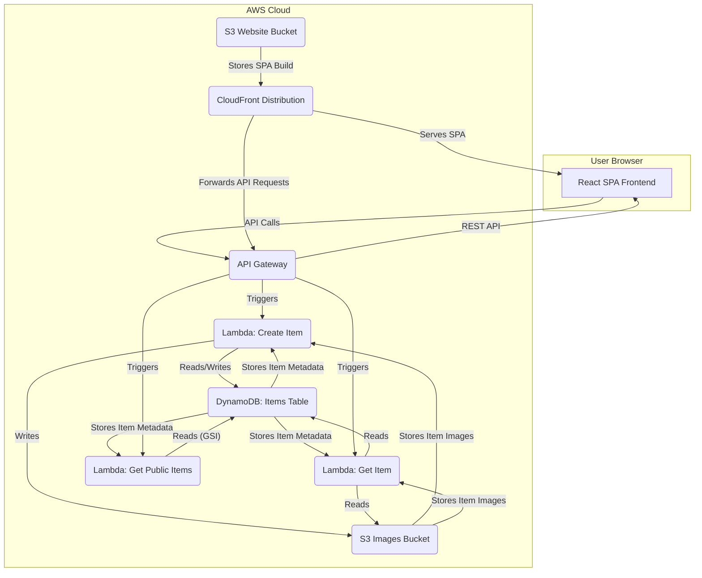

# DropMapp Application Architecture

This document outlines the technical architecture of the DropMapp application.

## Overview

DropMapp is a web application designed to allow users to "hide" items (represented by data like title, description, location, image) and share them either publicly or privately via a secret link. It follows a modern serverless architecture hosted on AWS, comprising a Single-Page Application (SPA) frontend and a serverless backend API.

## Frontend (`frontend/`)

*   **Framework:** React with TypeScript.
*   **Build Tool:** Vite.
*   **Styling:** Material UI (MUI).
*   **Routing:** `react-router-dom` for client-side routing.
*   **Key Components/Pages:**
    *   `App.tsx`: Main application shell, routing setup.
    *   `HomePage.tsx`: Landing page, likely includes the form to create/hide an item.
    *   `ItemPage.tsx`: Displays details of a specific item (fetched using ID and potentially a secret key).
    *   `CommunityMapPage.tsx`: Displays a map showing publicly shared items.
    *   `ItemForm.tsx`: Component for the item creation form.
    *   `Map.tsx`: Reusable Leaflet map component.
    *   `ImageUpload.tsx`: Component for handling image uploads.
*   **API Interaction:** Uses `fetch` via helper functions in `src/utils/api.ts` to communicate with the backend API Gateway. The base URL is configured via the `VITE_API_URL` environment variable.
*   **State Management:** Primarily component-level state using `useState`.

## Backend (API)

*   **Technology:** Serverless functions using AWS Lambda (Python 3.11 runtime).
*   **API Gateway (`HiddenItemsApi`):** Provides RESTful endpoints (`/items`, `/items/{id}`, `/public/items`). Handles request routing, CORS, and deployment stages (e.g., `prod`).
*   **Lambda Functions (`backend/functions/`):**
    *   `create_item`: Handles `POST /items`. Stores metadata in DynamoDB and image info (URL likely stored).
    *   `get_item`: Handles `GET /items/{id}`. Retrieves item data from DynamoDB. Includes logic for private items.
    *   `get_public_items`: Handles `GET /public/items`. Queries the DynamoDB Global Secondary Index (`visibility-created_at-index`) for public items.
    *   `get_all_items`: (Not exposed via API Gateway currently) Scans DynamoDB table.
*   **Data Storage:**
    *   **DynamoDB (`HiddenItemsTable`):** Stores item metadata. Uses Pay-Per-Request billing. Has a GSI on `visibility` and `created_at` for public queries.
    *   **S3 (`HiddenItemsImagesBucket`):** Stores uploaded image files. Configured with public read access and CORS for uploads.

## Infrastructure (`infrastructure/`)

*   **Provisioning:** AWS Cloud Development Kit (CDK) v2 using Python.
*   **Stack (`InfrastructureStack`):** Defines all AWS resources (S3, DynamoDB, Lambda, API Gateway, CloudFront, OAI) in `infrastructure/infrastructure/infrastructure_stack.py`. Resources are configured with `RemovalPolicy.DESTROY` for easier cleanup during development.
*   **Hosting:** Frontend SPA build is stored in `HiddenItemsWebsiteBucket`.
*   **CDN:** CloudFront (`HiddenItemsDistribution`) serves the SPA from S3 via Origin Access Identity (OAI), enforces HTTPS, and handles SPA routing (403/404 errors redirect to `/index.html`).

## Deployment

1.  **Frontend Build:** `npm run build` in `frontend/` creates production assets in `frontend/dist/`.
2.  **Infrastructure & Frontend Deployment:** `cdk deploy` executed in `infrastructure/` provisions/updates AWS resources *and* uses `s3deploy.BucketDeployment` to upload the contents of `frontend/dist/` to the S3 website bucket, invalidating the CloudFront cache (`/*`).

This architecture leverages managed AWS services for scalability and operational efficiency.