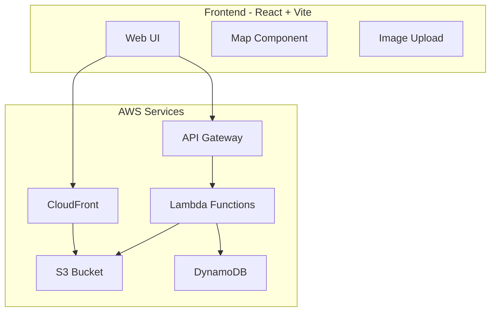
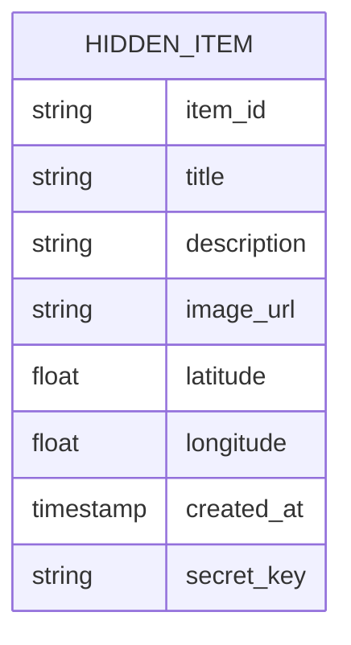
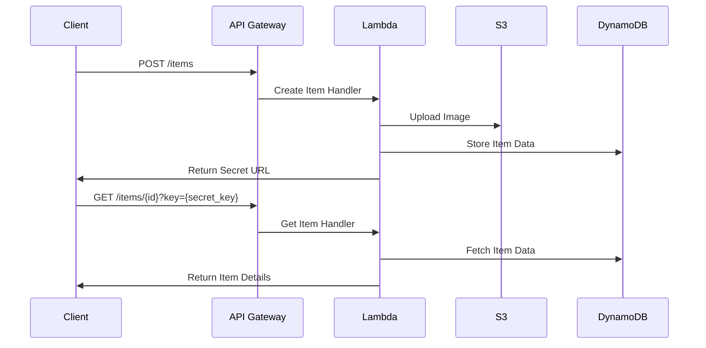

# UUbrella - Hidden Items Application Architecture Plan

## 1. System Architecture



## 2. Data Model



## 3. API Design



## 4. Technical Components

### Frontend (React + Vite)
- Single Page Application
- Components:
  - Map viewer (using Leaflet or Google Maps)
  - Image upload with preview
  - Location picker
  - Share link generator
- Styling with TailwindCSS

### Backend (Python Lambda)
- API Endpoints:
  - `POST /items` - Create new hidden item
  - `GET /items/{id}` - Get item details
- Image processing and optimization
- Secret URL generation

### Infrastructure (AWS CDK)
- S3 bucket for:
  - Frontend static hosting
  - Image storage
- DynamoDB table for item data
- Lambda functions
- API Gateway
- CloudFront distribution

## 5. Security Considerations
- Generate secure random URLs for each item
- Rate limiting on API endpoints
- Image file validation
- CORS configuration
- Content-Security-Policy headers

## 6. Cost Optimization
- Image optimization before storage
- CloudFront caching
- Lambda function optimization
- DynamoDB on-demand pricing
- S3 lifecycle policies

## 7. Implementation Phases

### Phase 1: MVP
1. Basic frontend setup with Vite and React
2. Core Lambda functions for item creation/retrieval
3. Basic map integration
4. Simple image upload
5. Infrastructure deployment

### Phase 2: Enhancements
1. Image optimization
2. Improved UI/UX
3. Better error handling
4. Loading states
5. Mobile responsiveness

### Phase 3: Additional Features
1. Item expiration
2. Multiple images per item
3. Optional contact information
4. Report inappropriate content
5. Analytics

## Directory Structure
```
nntin-uubrella/
├── frontend/
│   ├── src/
│   │   ├── components/
│   │   ├── hooks/
│   │   ├── pages/
│   │   └── utils/
│   ├── public/
│   └── index.html
├── backend/
│   ├── functions/
│   │   ├── create_item/
│   │   └── get_item/
│   └── layers/
├── infrastructure/
│   ├── lib/
│   │   └── stacks/
│   └── bin/
└── README.md